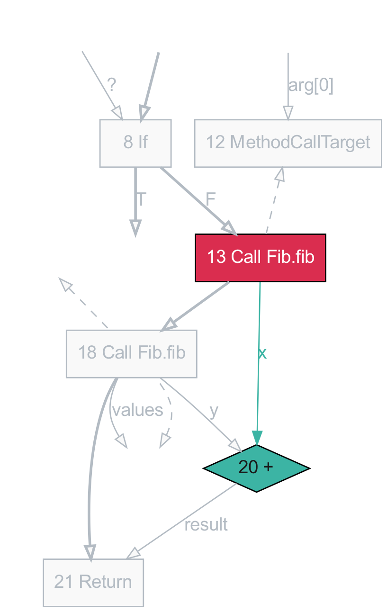
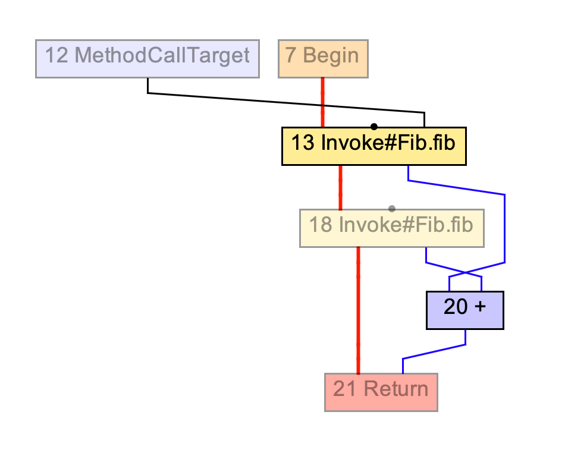

# PolyglotCommonInterfaceFinder
Finding a common interface where the results of analyses can be used across language boundaries.


# Using Seaform
Seafoam is a tool for working with compiler graphs dumped by the GraalVM compiler, including the Graal JIT, Native Image, and Truffle, it can be used to get a simplified view of GraalVM graphs.

## Generating compiler graphs
GraalVM can be configured to dump the graphs corrosponding to various phases of compilations.

### From Java

```
javac Fib.java
java -XX:CompileOnly=::fib -Dgraal.Dump=:1 Fib 14
```

### From Native Image

```
native-image -H:Dump=:1 -H:MethodFilter=fib Fib
```


## List graphs in a bgv file

```
seafoam examples/fib-java.bgv.gz list

examples/fib-java.bgv.gz:0  17:Fib.fib(int)/After parsing
examples/fib-java.bgv.gz:1  17:Fib.fib(int)/Before phase org.graalvm.compiler.phases.common.LoweringPhase
examples/fib-java.bgv.gz:2  17:Fib.fib(int)/After high tier
examples/fib-java.bgv.gz:3  17:Fib.fib(int)/After mid tier
examples/fib-java.bgv.gz:4  17:Fib.fib(int)/After low tier
...
```

## Render a graph using seaform

Render a graph as a PDF image and have it opened automatically.

```
seafoam examples/fib-java.bgv.gz:0 render
```

Render a graph showing just a few nodes and those surrounding them, similar to
the IGV feature of gradually revealing nodes.

```
seafoam examples/fib-java.bgv.gz:0 render --spotlight 13,20
```

<p>


</p>

`render` supports these options:

* `--out filename.pdf` or `.pdf`, `.svg`, `.png`, `.dot`, `.mmd`, `.md`
* `--md`
* `--option key value` for pass options.

## Options for customized graphs

* `--full-truffle-args` shows full Truffle argument nodes, which are simplified by default
* `--show-frame-state` shows frame state nodes, which are hidden by default
* `--no-simplify-alloc` turns off the pass to create synthetic allocation nodes
* `--show-reachability-fences` turns off the pass to hide reachability fences
* `--show-null-fields` shows null fields to allocations, which are hidden by default
* `--show-pi` shows *pi* nodes, which are hidden by default
* `--show-begin-end` shows *begin* and *end* nodes, which are hidden by default
* `--hide-floating` hides nodes that aren't fixed by control flow
* `--no-reduce-edges` turns off the pass to reduce the number of edges by inlining simple nodes above their users
* `--no-simplify` turns off passes that simplify the graph, except frame states are still hidden
* `--draw-blocks` to draw basic block information if available


# Generating .svg from .bgv using seaform via BashScript
The bashscript `bgv2svg.sh` generates simplified graphs in `svg` format additionally we can supply various flags to customize the graphs output. 
```
bash bgv2svg.sh <path to target graal dumps> <flag1> <flag2>....
```
Example:
```
bash bgv2svg.sh graal_dumps/2024.09.05.10.15.06.086/ --full-truffle-args --draw-blocks
```
